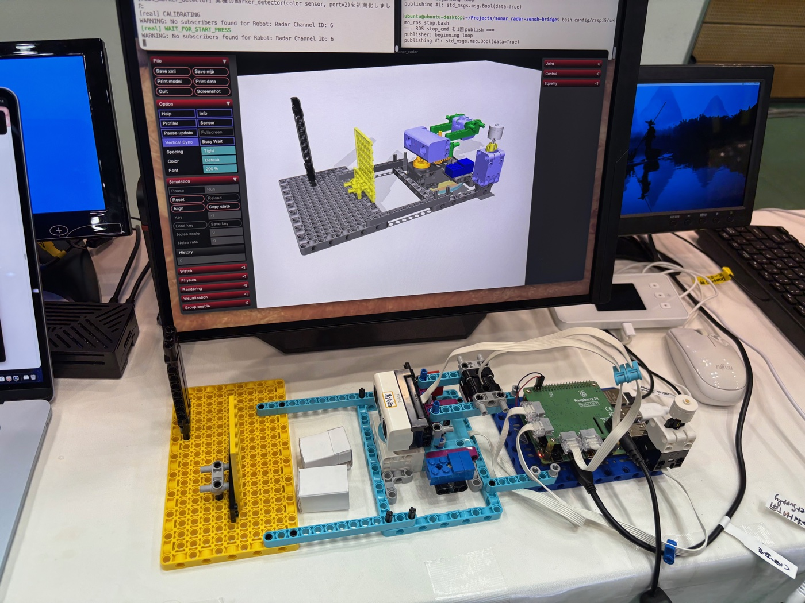
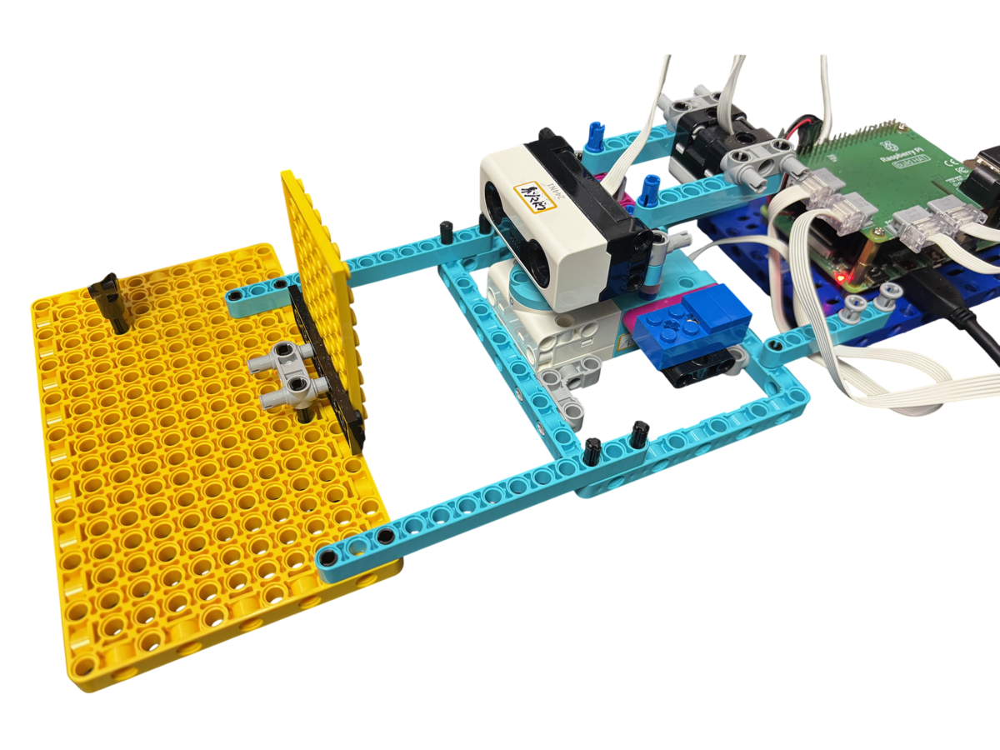

# sonar_radar-zenoh-bridge

[sonar_radar](https://github.com/kuboaki/sonar_radar) の実機とシミュレータを、複数マシンにまたがって Zenoh 経由の PDU（hakoniwa-pdu-endpoint / hakoniwa-pdu-ros）でリアルタイム同期させるトライアル。

sonar_radar 本体は「実機・スタンドアロンSIM・Hakoniwa SIM」という3つの環境をデジタルツインとして共存させる設計だが、本リポジトリはそれとは別レイヤーの実験として、**ネットワーク越しに複数マシン上で動く実機とシミュレータを、start/stop/calibrate等のイベント単位で疎結合に同期させる**ことを目的とする。

> **設計の転回（2回）**: 当初は `sonar_radar` 本体に手を入れる形で実装していたが、実装・実機検証を通じて設計上の問題が判明し、**`sonar_radar` は完全に無改造のまま使わず、本リポジトリ側に独立した「Zenoh版 sonar_radar」ステートマシンを新設する**方針に転回した（1回目）。さらにその後、実機・シムの2台構成での動作検証を重ねる中で、キャリブレーション完了をマシン間で待ち合わせる設計自体が人の操作速度に依存して壊れやすいことが判明し、**マシン間のキャリブレーション協調を廃止し、各マシンがローカルで独立にキャリブレーションを完了させる**方針に再転回した（2回目）。経緯と現在の状態機械設計は [`docs/zenoh_state_machine_design.md`](docs/zenoh_state_machine_design.md) を参照。このREADMEの一部セクション（特に下記「【廃案】sonar_radar 本体側で必要な変更」）は転回前の内容のままなので、矛盾する記述は設計ドキュメント側を正とする。



## 背景

Hakoniwa のコンダクターによる時刻同期（`hakopy.usleep()`）は単一ホスト内の複数アセットを密結合に同期させる仕組みで、今回のようにマシンをまたいだ「実機とシムがだいたい同じタイミングで動きつつ、イベント発生時だけ通信する」というユースケースには直接使えない。かわりに、各マシンが自律的にステートマシンの tick ループ（既存の「開いたループ」設計そのまま）を回しつつ、要所で Zenoh 経由の PDU を送受信することで疎結合な同期を実現する。

## 構成

| マシン | 実行するもの | 役割 |
|---|---|---|
| Raspberry Pi 4B+ | `sonar_radar`（実機） + pdu-endpoint (zenoh, client mode) | 実機の `SonarRadarSM` を駆動 |
| Mac | `sonar_radar_sim`（スタンドアロンSIM, mujoco, `--viewer`必須） + pdu-endpoint (zenoh) + zenohd（ルーター） | シム版 `SonarRadarSM` を駆動。zenohd も同居 |
| Raspberry Pi 5 | `hakoniwa-pdu-ros` bridge + pdu-endpoint (zenoh, client mode) | 実機・シム双方のPDUをROSトピックとして中継・モニタリング、外部コマンド注入点 |

実機・シムはそれぞれ zenohd (Mac 上) へ `client` mode で接続する（`peer` mode ではなく、ルーター経由）。



## PDU トピック設計

`SonarRadarSM` の状態遷移イベントそのものを PDU 化する（低レベルI/O値のPDU化ではない）。実機・シムは対称に、自分のイベントを publish し、相手のイベントを subscribe する。

| topic | 意味 | 発生元 | 購読先 |
|---|---|---|---|
| `radar/starter/start` | スキャン開始 | 実機starter / シムstarter / ブリッジ疑似starter | 実機, シム, ブリッジ（モニタ） |
| `radar/starter/stop` | スキャン停止 | 同上 | 同上 |
| `radar/detector/detected` | マーカー検出→方向反転 | 実機 or シムの marker_detector | 相手側、ブリッジ（モニタ） |
| `radar/scanner/scan` | スキャンデータ（angle, dome_angle, distance_mm） | 実機・シム双方の scanner | ブリッジ（→ROSトピック送出） |

## 【廃案】sonar_radar 本体側で必要な変更

> **この節は転回前の設計であり、現在は採用していない。** 経緯は上記「設計の転回」および [`docs/zenoh_state_machine_design.md`](docs/zenoh_state_machine_design.md) の「背景」を参照。実際にコミット `038ed15` として実装・実機検証まで行ったが、(1) Zenohの自己ループバック、(2) 起動順序に依存する取りこぼし、(3) ローカルクリックだけ特別扱いする非対称設計、という3つの問題が見つかり、`sonar_radar` 本体は元に戻す（revert）ことにした。**revert 自体はまだ実行していない**（2026-07-24時点、`sonar_radar` はまだコミット `038ed15` のまま）。以下は記録として残す。

コアの `SonarRadarSM`（`sonar_radar` リポジトリ側）に、以下の小さな変更を加える必要がある。既存の「1状態=1つの待つできごと」というフラットなステートマシン設計方針に従う。

### 新状態: `WAIT_FOR_PEER_CALIBRATED`

```
INIT → CALIB_TO_ZERO → CALIB_TO_OFFSET → WAIT_FOR_PEER_CALIBRATED → WAIT_FOR_START → SCANNING → RETURN_TO_ORIGIN → TERMINATED
```

- `CALIB_TO_OFFSET` 完了時（`zero_pos` 記録直後）に自分の `calibrated` を publish してから遷移
- 「待つもの」＝相手からの `calibrated` 受信のみ
- endpoint 未設定（従来通りの単独実行）の場合は即座に素通りし、既存の動作を変えない

### イベントフック（オプショナル注入）

`SonarRadarSM` のコンストラクタに、以下のタイミングで呼ばれるコールバックを注入できるようにする（未指定時は no-op、既存動作は不変）。

- 送信: フォースセンサークリック検出時、マーカー検出時、キャリブレーション完了時、スキャンデータ記録時
- 受信: `tick()` 冒頭で `endpoint.process_recv_events()` をポーリング呼び出しし、登録済みコールバック経由でインスタンスフラグ（例: `self._peer_calibrated`）を更新する。非同期ディスパッチ（`start_dispatch()`）は使わず、単一スレッド・同期処理の既存方針を維持する

## ディレクトリ構成（実装済み）

```
sonar_radar-zenoh-bridge/
├── README.md
├── docs/
│   ├── zenoh_state_machine_design.md  # 設計転回後の状態機械設計（進行中）
│   └── development_log.md             # 「テストによる段階的な開発」の進め方と教訓の記録
├── pdu/
│   ├── pdudef.json           # robot_name="Radar" で pdutypes.json を参照
│   └── pdutypes.json         # channel 2-6（start/stop/detected/scan/state）。calibrate/calibratedは
│                              # マシン間協調廃止に伴い廃止済み(欠番0/1は詰め直していない)
├── config/
│   ├── mac/                  # シム側 endpoint 設定。zenohd はMac自身がローカル(127.0.0.1)で稼働する前提
│   │   ├── endpoint_zenoh.json
│   │   ├── cache/buffer.json
│   │   ├── comm/{zenoh_pubsub_comm.json, zenoh/client.json5}
│   │   └── zenohd/router.json5   # zenohd自体の起動設定（REST + memory storage付き）
│   └── raspi4b/               # 実機側 endpoint 設定。zenoh/client.json5 が Mac の LAN IP へ接続
│       ├── endpoint_zenoh.json
│       ├── cache/buffer.json
│       └── comm/{zenoh_pubsub_comm.json, zenoh/client.json5}
├── bridge/                    # 新設計に基づく実装(状態機械図を1状態ずつ実装しながら進める)
│   ├── spikehat_timer.py      # ワンショットタイマー(C移植を見据えた関数シグネチャ)
│   ├── broker.py              # PDU publish/受信を担う抽象層(hakoniwa_pdu_endpoint.Endpointのラップ)
│   ├── sonar_radar_app.py     # ステートマシン本体
│   ├── app_runner.py          # SonarRadarAppの構築・tickループ・state reportingの共通部分
│   ├── hardware.py            # 実機/SIMの配線層(RadarHardware契約、RealHardware/HakoHardware)
│   ├── device_types.py        # libspikehatのポートデバイスタイプ定数(実機spikehatモジュールに非依存)
│   ├── radar_base.py          # sonar_radar::unit::radar_base(旋回モーター)。実機/SIM共通の単一クラス
│   ├── marker_detector.py     # sonar_radar::unit::marker_detector(色センサー)。実機/SIM共通の単一クラス
│   ├── scanner.py             # sonar_radar::unit::scanner(距離センサー)。実機/SIM共通の単一クラス
│   ├── starter.py             # sonar_radar::unit::starter(フォースセンサー)。実機/SIM共通の単一クラス
│   ├── real_hat.py            # 実機libspikehatのSpikeHat()構築(radar_base/starterで共有)
│   ├── run_real.py            # 実機での動作確認エントリポイント(app_runnerを使用)
│   ├── run_hako.py            # MuJoCo(Hakoniwa plant)経由の動作確認エントリポイント(hakopy controller)
│   ├── plot_scan.py           # scanチャンネルをリアルタイムに極座標プロットする可視化ツール
│   ├── sonar_radar_ros_bridge.py
│   │                           # pdu_ros_bridge::sonar_radar_ros_bridge(Zenoh専用・rclpy非依存)。
│   │                           # scanを蓄積しscan_batch(sensor_msgs/PointCloud)としてpublishする(Pi5で動かす)
│   └── watch_state.py / watch_all.py / console_report.py / state_reporter.py
│                               # 状態遷移・生メッセージの観測ツール群
├── ros/                       # rclpy依存のツール(bridge/はZenoh専用・rclpy非依存の不変条件を保つため分離)
│   └── scan_batch_viewer.py   # rclpy + matplotlib WebAggで/pdu/sonar_radar/scan_batchを極座標表示(Pi5で動かす)
└── driver/
    └── sonar_radar_zenoh.py   # 【旧, 使わない】sonar_radar の SonarRadarSM を import して
                                 # on_event/notify_*() で配線する転回前の実装。bridge/ に
                                 # 置き換わっていく
```

`config/raspi5/`（`hakoniwa-pdu-ros` bridge 用設定）はネットワーク接続・基本設定まで完了(#14)。`pdu_ros_bridge::sonar_radar_ros_bridge`本体の実装は進行中、詳細は[`docs/pdu_ros_bridge_ros_zenoh_mapping.md`](docs/pdu_ros_bridge_ros_zenoh_mapping.md)を参照。

### PDU定義の実装メモ

`start`/`stop`/`detected`/`state`は、`hakoniwa_pdu_ros`(Pi5)の汎用PDU⇔ROS中継が変換できるよう、`hakoniwa_pdu`パッケージ(pip名`hakoniwa-pdu`)の標準メッセージ型でエンコードしている(`start`/`stop`/`detected`は`std_msgs/Bool`、`state`は`std_msgs/String`)。当初は独自の生バイト形式(`raw/Trigger`等)だったが、標準型でなければ`hakoniwa_pdu_ros`が中継できないことが判明し、2026-08-03に置き換えた。詳細・経緯は[`docs/pdu_ros_bridge_ros_zenoh_mapping.md`](docs/pdu_ros_bridge_ros_zenoh_mapping.md)を参照。

`scan`(個別のスキャン点、Zenoh内部専用でROSへは直接渡らない)のペイロードは自前のバイナリ形式のまま(`struct.pack("<Bidi", origin, angle, dome_angle, distance_mm)`、17バイト固定)。`angle`はモーターの生角度、`dome_angle`はギア比補正後のドーム角度(`-angle/gear_ratio`)。

### ドライバスクリプトの受信方式について（重要な訂正）

設計段階では「`process_recv_events()`をtickループでポーリングする（A案）」を採用する想定だった。しかし実装時に判明した通り、**この仕組みはSHM（共有メモリ）バックエンド専用で、Zenohバックエンドでは何もしない（no-op）**。Zenohの受信は`z_declare_subscriber`のコールバックがZenoh内部スレッドから直接・非同期に呼ばれる方式で、選択の余地なくB案（非同期コールバック）になる。

ただし影響は`driver/sonar_radar_zenoh.py`側の実装（`subscribe_on_recv_callback_by_name`を直接使う）に閉じており、`sonar_radar`本体の`notify_*()`（単純なbool代入のみ）は元々A案/B案どちらでも動く設計だったため、変更不要だった。

## 実装状況（マシンごと）

| マシン | hakoniwa-pdu-endpoint | 状態 |
|---|---|---|
| Mac（このリポジトリの作業機） | Zenoh有効でビルド・`.local`インストール済み | `bridge/`単体・実機との2台構成でSCANNING到達まで動作確認済み。`hakoniwa-mujoco-robots`のMuJoCo plant(`sonar_radar_hako.py`)経由(`run_hako.py`)でも同様に確認済み(実機leader+Macシミュレータfollowerの2台構成含む) |
| Raspberry Pi 4B+ (`192.168.11.3`, 実機, ホスト名`spike-hat`) | Zenoh有効でビルド・`.local`インストール済み | `sonar_radar-zenoh-bridge`を最新化し、Macとの2台構成でキャリブレーション・start協調動作を実ネットワーク越しに確認済み。実機の物理starterボタン、`radar_base`(旋回モーター)によるキャリブレーションの実接続も確認済み(`bridge/real_starter.py`/`bridge/real_radar_base.py`)。詳細は[`docs/development_log.md`](docs/development_log.md) |
| Raspberry Pi 5 (`192.168.1.4`, Ubuntu 24.04 + ROS2 jazzy) | インストール済み（別トライアルで構築） | `sonar_radar-zenoh-bridge`は未クローン、`config/raspi5`も未着手。ブリッジ/モニタ役として今後着手する |

### Mac向けビルドで詰まった点

ラズパイ向けビルド（別トライアル、hakoniwa-pdu-endpoint#36 参照）とほぼ同じ手順だが、macOS固有の差分があった。

- **Python 3.14ではcffi 1.16.0がビルドできない**。cffi 1.16.0（2023年リリース）は`_PyUnicode_AsString`等、Python 3.14で削除された非推奨APIを使っており、ソースビルドがコンパイルエラーになる。`brew install python@3.12`のPython 3.12を明示的に使う必要がある（`sonar_radar`本体が元々Python 3.12前提なのはこれが理由の一つでもある）
- **`HAKO_PDU_ENDPOINT_ENABLE_HAKONIWA_CORE`はmacOSでもデフォルトON**（`WIN32`以外は全てON）。今回はSHM(Hakoniwa Core)を使わずZenohのみで良いため、`-DHAKO_PDU_ENDPOINT_ENABLE_HAKONIWA_CORE=OFF`を明示して、hakoniwa-core-proのビルドという大きな追加作業を回避した
- **cffi 1.16.0のビルドに`setuptools`が必要**（Python 3.12の素のvenvには入っていない）。`pip install -U setuptools wheel`が必要（README.ja.mdのトラブルシューティングに記載あり）
- **`sonar_radar/.venv`は`uv venv`で作られており、`pip`コマンド自体が入っていない**。うっかり`source .venv/bin/activate && pip install ...`とすると、activateが効いていてもPATH解決の都合でシステムのpip（別のPythonバージョン向け）に誤ってインストールしてしまうことがあった。`uv pip install <pkg>`（venvのある場所で実行）を使うのが安全

## 実行方法（現時点で動く範囲）

`hakoniwa_pdu_endpoint`の動作確認だけなら、`sonar_radar`の venv から以下で確認できる。

```bash
cd ~/Projects/sonar_radar
source .venv/bin/activate
PYTHONPATH=$HOME/.local/lib/hakoniwa-pdu-endpoint/python \
HAKO_PDU_ENDPOINT_LIB_DIR=$HOME/.local/lib/hakoniwa-pdu-endpoint/python/hakoniwa_pdu_endpoint \
HAKO_PDU_ENDPOINT_SHARED_LIB=$HOME/.local/lib/hakoniwa-pdu-endpoint/python/hakoniwa_pdu_endpoint/libhakoniwa_pdu_endpoint.dylib \
python3 -c "from hakoniwa_pdu_endpoint import c_endpoint; print('import ok')"
```

`driver/sonar_radar_zenoh.py`（旧実装）自体の実行は未検証・今後使わない。かわりに`bridge/`配下の新実装は以下の手順で動作確認できる。

`bridge/env.sh`は`hakoniwa_pdu_endpoint`用の環境変数(`PYTHONPATH`等)をまとめたもの。Pythonの実行環境自体は`sonar_radar/.venv`（Python 3.12, cffi対応）を流用している(`run_hako.py`のみ、hakopyとPythonバージョンを合わせる都合で`hakoniwa-mujoco-robots/.venv`のPython 3.14を使う。後述)。

### デモ用スクリプト(手順を覚える必要が無い、まずここを見る)

手順を毎回手で組み立てると、`--config`忘れ・タイムアウト不揃い等の
ミスが起きやすいと分かったため、正しいフラグを組み込んだ起動スクリプト
を`bridge/`に用意してある。以下の手順の詳細(順序の理由等)を知りたい
ときだけ、この後の各節を読めばよい。

| 何をしたいか | 実行する機 | コマンド |
|---|---|---|
| 動作シナリオ1(実機単体でのstart確認) | 実機 | `bash bridge/demo_real_leader.bash` |
| 動作シナリオ2(シミュレータ単体でのstart確認) | Mac | `bash bridge/demo_hako_leader.bash`(要plant起動済み、下記参照) |
| 実機+Macの2台構成デモ(実機側) | 実機 | `bash bridge/demo_real_leader.bash`(単体と同じコマンドでよい) |
| 実機+Macの2台構成デモ(Mac側、follower) | Mac | `bash bridge/demo_mac_follower.bash` |
| 状態遷移の観測(origin付き) | どちらでも | `bash bridge/demo_watch.bash state` |
| 生のPDUメッセージの観測 | どちらでも | `bash bridge/demo_watch.bash all`(既定) |
| 残存プロセスの確認・掃除 | どちらでも | `bash bridge/cleanup.bash --dry-run` / `bash bridge/cleanup.bash` |

2台構成デモは、Mac側→`hako-cmd`不要な`run_real.py`同士の組み合わせなら
上記2つだけでよい。MuJoCoシミュレータ経由(`run_hako.py`)で試したい場合は
後述の「`bridge/` をMuJoCoシミュレータ(Hakoniwa plant)経由で動かす」を
参照(plant起動・`hako-cmd start`が別途必要)。

`demo_real_leader.bash`/`demo_mac_follower.bash`は起動前に必ず
`cleanup.bash`を実行する(観測用ターミナルは`--skip-watchers`で対象外)。
`bash bridge/demo_real_leader.bash`実行後、`WAIT_FOR_START_PRESS`に
なったら実機の物理starterボタンを押すこと。

`demo_hako_leader.bash`は、Hakoniwa plant(ビューア付き)が別ターミナルで
起動済みであることが前提(cleanup.bashを自動実行するとplant/ビューアも
巻き込んで止めてしまうため、このスクリプトだけは呼ばない)。実行して
`'SonarRadarZenohBridgeController' 登録完了`と出たら、別ターミナルで
`hako-cmd start`を実行し、`WAIT_FOR_START_PRESS`になったらMuJoCoビューアの
ウィンドウでSpaceキーを押すこと。

### `bridge/` の動作確認（単体、1プロセス自己ループバック）

1. zenohdルーターを起動する（`config/mac/zenohd/router.json5`を使用。既に起動中なら不要）。

   ```bash
   cd ~/Projects/sonar_radar-zenoh-bridge/config/mac/zenohd
   zenohd -c router.json5
   ```

2. 別ターミナルで、状態遷移を監視するwatchスクリプトを起動しておく（推奨。任意のタイミングで起動・終了してよい）。**`2>/dev/null`を必ず付けること** — 付けないとhakoniwa_pdu_endpointライブラリの`WARNING: No subscribers found...`が大量にstderrへ出て、肝心の状態遷移が埋もれる。

   ```bash
   cd ~/Projects/sonar_radar-zenoh-bridge/bridge
   source env.sh
   source ~/Projects/sonar_radar/.venv/bin/activate
   python3 watch_state.py 2>/dev/null
   ```

   `watch_state.py`はアプリが自己申告する`state`チャンネルだけを見る。実装のバグで自己申告自体が誤りうるため、アプリの申告に頼らず生のトリガーメッセージ(`start`/`stop`/`detected`/`scan`)を直接確認したい場合は`watch_all.py`を使う(使い方は同じ、`2>/dev/null`も同様に付けること)。

   ```bash
   python3 watch_all.py 2>/dev/null
   ```

   **注意**: `driver/sonar_radar_zenoh.py`(旧実装、使わない)を過去に起動したまま放置していないか、`ps aux | grep sonar_radar`で必ず確認すること。同じzenohdに向けて動いたままだと、`scan`/`detected`等のノイズが混ざり続け、正常に動いているかの判断を誤らせる（実際に数日放置されたまま気づかず、この文書化のきっかけになった）。

   デモの中断等で関連プロセスが残ることがあるため、`bridge/cleanup.bash`で一括確認・停止できる(Mac・実機どちらでも同じスクリプトが使える。2台構成なら両方の機で実行すること)。

   ```bash
   bash bridge/cleanup.bash --dry-run  # 見つけたプロセスを表示するだけ
   bash bridge/cleanup.bash            # 見つけたプロセスを停止する
   ```

   気づくきっかけとして、`run_real.py`/`run_hako.py`は起動のたびに旧`driver/sonar_radar_zenoh.py`が動いていないか自動チェックし、見つかれば赤字で警告する(`app_runner.py`の`_warn_if_legacy_driver_running()`)。

   `run_real.py`/`run_hako.py`側の出力にも同じ`WARNING`が混ざるので、状態を確認したいときはこの`watch_state.py`側のターミナルだけを見ればよい。1台構成でも2台構成でも、同じzenohdに繋がっていれば全origin(マシン)の状態遷移がここに集まる。

3. さらに別ターミナルで、`run_real.py`を実行する（`--leader`を付けるとダミーのstarterで最後まで進む。付けなければキャリブレーション後`WAIT_FOR_START_PRESS`で待機したままタイムアウトする＝そこまでは正常）。

   ```bash
   cd ~/Projects/sonar_radar-zenoh-bridge/bridge
   source env.sh
   source ~/Projects/sonar_radar/.venv/bin/activate
   python3 run_real.py --leader --timeout 15
   ```

   `watch_state.py`側のターミナルに `[origin=1] CALIBRATING` → `WAIT_FOR_START_PRESS` → `WAIT_FOR_START_RELEASE` → `WAIT_FOR_SCAN_START` → `SCANNING` と時刻・origin付きで表示されれば成功。`CALIBRATING`はマシン間協調を行わないローカル処理なので、2台構成でも各originが独立したタイミングで通過する(お互いを待ち合わせない)。`WAIT_FOR_START_PRESS`以降は、`start`メッセージの送受信でorigin間が協調する。`zenohd`のREST経由でも直近の値だけは確認できる（`curl http://localhost:8000/radar/dome/state`。ただし全originで1つの値を共有するため直近の1件しか分からず、経過や区別を追うにはwatch_state.pyを使うこと）。

   実機のハードウェアを使う場合は`--real-radar-base`（旋回モーター）・`--real-starter`（フォースセンサー）を付ける（Raspberry Pi上でのみ動作。Build HATは同時オープンをサポートしないため、両方を同時に指定した場合は`real_hat.py`が構築する単一の接続を共有する）。

   タイムアウト値等のパラメータが増えてきたため、`--params-json path/to/params.json`でまとめて指定できる。JSON側の値はコマンドライン未指定時の既定値として使われるだけなので、同じ引数をコマンドラインでも指定すればそちらが優先される（`run_real.py`/`run_hako.py`共通）。

   ```json
   {"scanning_timeout": 10.0, "calibration_timeout": 20.0, "scan_grace_timeout": 15.0}
   ```

   ```bash
   python3 run_real.py --leader --params-json params.json --timeout 15
   ```

### `bridge/` をMuJoCoシミュレータ(Hakoniwa plant)経由で動かす

**前提**: `hakoniwa-mujoco-robots`側の環境構築（`.python-version`をHomebrewの`python@3.14`に合わせ、`uv sync`で`.venv`を作る。`mujoco`だけでなく`bridge/`が使う`cffi`も必要）が済んでいること。詳細は`hakoniwa-mujoco-robots`リポジトリを参照。

1. zenohdルーターを起動する（上と同じ）。

2. Hakoniwa plant(MuJoCo本体、ビューア表示)を起動する。`SonarRadarAsset`の登録完了まで待つ。

   ```bash
   cd ~/Projects/hakoniwa-mujoco-robots
   MJPYTHON="$(pwd)/.venv/bin/mjpython" bash run-hakopy.bash ~/Projects/sonar_radar/sim/sonar_radar_hako.py --viewer --debug
   ```

3. 別ターミナルで、`run_hako.py`をhakopy controllerとして登録する。`SonarRadarZenohBridgeController`の登録完了まで待つ（この時点ではまだZenohの購読は始まっていない）。

   ```bash
   cd ~/Projects/hakoniwa-mujoco-robots
   source ~/Projects/sonar_radar-zenoh-bridge/bridge/env.sh
   bash run-hakopy.bash ~/Projects/sonar_radar-zenoh-bridge/bridge/run_hako.py --origin 1 --leader --timeout 30
   ```

4. **さらに別ターミナルで`hako-cmd start`を実行する。ここで初めてrun_hako.pyのtickループ(broker.open()によるZenoh購読を含む)が動き出す。**

   ```bash
   hako-cmd start
   ```

   ビューアでレーダードームが回転し、`watch_state.py`(起動していれば)に状態遷移が表示されれば成功。

### 実機とシミュレータの2台構成（起動順序について）

**キャリブレーション(`INIT`→`CALIBRATING`)はマシン間協調を行わないローカル処理のため、実機とMacの起動順序に制約は無い**（[`docs/zenoh_state_machine_design.md`](docs/zenoh_state_machine_design.md)「背景: キャリブレーション協調の廃止」参照）。

以前は「双方のbroker.open()(Zenoh購読)が、お互いの`calibrated`publishより先に完了している必要がある」という制約があり、実機を先に起動しMacの`hako-cmd start`を最後にする、という順序ルールを何度か試行錯誤して定めていた。しかし実機側のキャリブレーション自体が数秒で終わってしまうため、人がその間に`hako-cmd start`を押しきれず結局取りこぼす、という事故が起動順序をどう変えても再発した。根本原因は「購読開始が人の操作待ちでゲートされている側は、相手の完了に間に合わない可能性がある」という構造そのものにあったため、キャリブレーションのマシン間協調自体を廃止した。

現在制約が残るのは、`WAIT_FOR_START_PRESS`以降の`start`メッセージのやり取りのみ。Mac(`run_hako.py`)側は、hakopy controllerとして登録されるだけでは`broker.open()`されず、`hako-cmd start`が呼ばれて初めてtickループ(≒`broker.open()`)が動き出す(hakopyの仕組み上の制約)。そのため、**実機側でstarterボタンを押す(スキャン開始する)のは、Macの`hako-cmd start`を済ませた後にすること**。逆にキャリブレーションは待ち合わせが無いので、実機のプロセス自体はMacより先でも後でも起動してよい。

1. Mac: plantを起動する（上記の2）
2. Mac: `run_hako.py`を起動する（上記の3。leader/followerどちらでもよい、`--leader`の有無で決める）
3. 実機: `run_real.py --real-starter --real-radar-base`を実行する（leaderなら`--leader`も付ける。Macより先でも後でもよい）
4. Mac: `hako-cmd start`を実行する（上記の4）
5. 実機側でstarterボタンを押す（`hako-cmd start`より前に押してしまうと、Mac側がまだ`start`を購読しておらず取りこぼす）

この順序を守れば、followerである側はstarterの操作なしで、`radar/starter/start`の受信のみで`WAIT_FOR_START_PRESS`から`SCANNING`へ直接遷移する。

観測方法（`watch_state.py`/`watch_all.py`）は「`bridge/`の動作確認（単体、1プロセス自己ループバック）」の節を参照（1台構成でも2台構成でも同じ方法が使え、全origin(マシン)の状態遷移が1つのターミナルに集まる）。

### scanデータのリアルタイム可視化(`plot_scan.py`)

`bridge/plot_scan.py`は`scan`チャンネル(angle/dome_angle/distance_mm)を購読し、`matplotlib`の極座標プロットでリアルタイム表示する。origin毎に別色で表示するため、実機・シムを同時に動かすと1つのウィンドウ上に重ねて表示される。

```bash
cd ~/Projects/sonar_radar-zenoh-bridge/bridge
source env.sh
source ~/Projects/sonar_radar/.venv/bin/activate   # 実機は ../.venv を使う(下記参照)
python3 plot_scan.py --config ../config/mac/endpoint_zenoh.json   # Macの場合(既定値なので省略可)
```

**実機(Raspberry Pi)で使う場合の注意点**:

- 実機の`.venv`(`sonar_radar-zenoh-bridge/.venv`、`sonar_radar/.venv`とは別)に`matplotlib`が入っていない場合は`source ../.venv/bin/activate && pip install matplotlib`で追加する。
- `--config ../config/raspi4b/endpoint_zenoh.json`を明示的に指定すること(既定値はMac向け設定のため)。
- **SSH経由で実行するとGUIウィンドウは表示されない**(`DISPLAY`が渡らずmatplotlibが非対話バックエンド`agg`にフォールバックし、ウィンドウを開かないまま終了する)。実機のディスプレイに直接出力したい場合は、実機のローカルコンソール(lightdm配下のデスクトップセッション)で実行すること。

**実機とシムを重ねて可視化したい場合**は、実機側でGUI表示させる必要はない。実機は通常通りSSHで`run_real.py`等を動かしたまま、**Mac側で`plot_scan.py`(既定のMac向け設定)を実行するだけで、zenohd経由で実機originのscanもMacの1つのウィンドウに重畳表示される**(実機・Mac双方が同じzenohdに繋がっていれば、追加設定は不要)。実際に実機からのscanをMac側で受信できることを確認済み。

`plot_scan.py`は`state`チャンネルも監視しており、そのoriginがCALIBRATING(各デモ実行の最初に必ず1回だけ発生)になると、蓄積済みプロットをそのoriginだけ消去する(壁を動かした後の測定を前回までと混ぜて見ないため)。`--max-points`(既定20000、origin毎)は通常の1スキャンセッションでは到達しない安全上限で、無制限のメモリ増加を防ぐためだけのもの。

このCALIBRATING連動の自動消去とは別に、**プロットウィンドウをクリックしてアクティブにした状態で`x`キーを押すと、スキャンの状態に関わらずいつでも全origin分を手動消去できる**(`x`はmatplotlibの既定キーマップと衝突しないことを確認済み)。

### scan_batchのROS経由可視化(`ros/scan_batch_viewer.py`)

実機(Pi4)とSIM(Mac)、2台分のスキャンをROS経由でブラウザに重畳表示する(`pdu_ros_bridge::sonar_radar_ros_bridge`設計の実装)。Pi5で以下3つをそれぞれ別ターミナルで起動する。

```bash
cd ~/Projects/sonar_radar-zenoh-bridge
bash config/raspi5/run_ros_bridge_scan_batch.bash      # hakoniwa_pdu_rosのscan_batch/state中継
bash config/raspi5/run_sonar_radar_ros_bridge.bash      # scan集約・scan_batch publish
bash config/raspi5/run_scan_batch_viewer.bash           # rclpy + matplotlib WebAgg
```

起動後、同じLAN上の任意のブラウザで`http://<Pi5のIP>:8988/`を開く。`plot_scan.py`と同じく、originがCALIBRATINGになると該当originのプロットを消去する(ROS版は`/pdu/sonar_radar/state`トピックを購読)。ブラウザ側のプロット領域をクリックしてアクティブにした状態で`x`キーを押せば、`plot_scan.py`と同じく全origin分を手動消去できる(WebAggはブラウザからのキー入力をサーバー側へ転送する標準機構を持つため、追加設定なしに動作する)。

**注意点**:
- `hakoniwa_pdu_ros`はROSトピック名を`direction: "pdu_to_ros"`のbindingでは常に`/pdu`名前空間の下へマッピングする(bindingの`topic`指定に関わらず、実際は`/pdu/sonar_radar/scan_batch`等になる)。
- サーバープロセス(`scan_batch_viewer.py`)を再起動した後は、ブラウザタブの**再読み込みが必須**(WebAggのdiffベース描画が古いセッションのまま残ることがある)。
- 複数プロセスの多重起動(同一ノード名・同一ポート8988の衝突)に注意。`ps aux | grep '[s]can_batch_viewer'`(角括弧トリックで自己マッチを避ける)で確認し、古いプロセスは`kill`してから起動し直すこと。

## 依存リポジトリ

- [sonar_radar](https://github.com/kuboaki/sonar_radar) — 参考にする既存のドメインロジック（キャリブレーション・starter・スキャン）だが、**本リポジトリはこれをimportせず無改造のまま扱う**。過去の設計転回前の変更（`WAIT_FOR_PEER_CALIBRATED`状態、`on_event`/`notify_*()`フック、コミット`038ed15`）はrevert済み（`19eccc5`）。実機での経過時間計測のため、状態遷移ログへの`_clock()`タイムスタンプ出力も追加済み（`74f374b`）
- [hakoniwa-pdu-endpoint](https://github.com/hakoniwalab/hakoniwa-pdu-endpoint) — Zenoh 経由の PDU 通信ライブラリ
- [hakoniwa-pdu-ros](https://github.com/hakoniwalab/hakoniwa-pdu-ros) — PDU⇄ROSトピック ブリッジ

## 残作業・次のステップ

**設計継続（優先）**

1. [`docs/zenoh_state_machine_design.md`](docs/zenoh_state_machine_design.md) の状態機械設計を継続（`WAIT_FOR_START_PRESS`〜`SCAN_FAILED`まで含め全状態を実装・確認済み。`pdu_ros_bridge::sonar_radar_ros_bridge`、`CALIBRATION_FAILED`/`SCAN_FAILED`の失敗時処理の具体化などが未確定のまま残っている）

**実装作業（状態機械図を1状態ずつ実装しながら進める方式、進行中。進め方と教訓は[`docs/development_log.md`](docs/development_log.md)を参照）**

2. [x] `bridge/` パッケージを新設。`INIT → WAIT_FOR_CALIBRATE → CALIBRATING → WAIT_FOR_CALIBRATED → (WAIT_FOR_START_PRESS | CALIBRATION_FAILED → TERMINATED)` を実装し、1プロセス構成(`calibration_participants = {自分のorigin}`)で実際のZenoh(zenohd + hakoniwa_pdu_endpoint)経由のpublish/受信により、成功経路・失敗経路(タイムアウト)の両方を動作確認済み(現`bridge/run_real.py`)。**(2026-07-29: この`WAIT_FOR_CALIBRATE`/`WAIT_FOR_CALIBRATED`によるマシン間協調は後に#10で廃止。現在は`INIT → CALIBRATING → WAIT_FOR_START_PRESS`)**
3. [x] 実機Raspberry Pi 4B+とMacの2台構成で、キャリブレーションの協調動作(`calibration_participants`が複数originで揃うこと)を実ネットワーク越しに確認済み。詳細は[`docs/development_log.md`](docs/development_log.md)を参照。**(2026-07-29: この協調動作自体を#10で廃止)**
4. [x] `WAIT_FOR_START_PRESS` / `WAIT_FOR_START_RELEASE` / `WAIT_FOR_SCAN_START` / `SCANNING`（到達まで）を実装し、実機Raspberry Pi 4B+とMacの2台構成（デモ会場用の別ルーター経由）でstart協調動作を確認済み(現`bridge/run_real.py`)。詳細は[`docs/development_log.md`](docs/development_log.md)を参照。
5. [x] `bridge/real_starter.py`(`RealStarter`)を新設し、擬似スイッチではなく実機のフォースセンサー(libspikehat)を直接使う`--real-starter`オプションを追加。実際に実機の物理ボタンを押して、実機・Macとも`SCANNING`まで到達することを確認済み。Build HATには準備完了を問い合わせるAPIが無いため、実際にセンサーが読めるようになるまでポーリングして待つ仕組みを実装した。
6. [x] キャリブレーション処理自体が未実装だった設計上の欠落を修正（`WAIT_CALIBRATED`を`WAIT_FOR_CALIBRATE`/`CALIBRATING`/`WAIT_FOR_CALIBRATED`の3状態に分割）。`bridge/real_radar_base.py`(`RealRadarBase`)を新設し、擬似スタブではなく実機のモーター(libspikehat)を直接使う`--real-radar-base`オプションを追加。実際にモーターが機械的0位置→オフセット位置へホーミングし、`CALIBRATING`が完了することを実機で確認済み。詳細は[`docs/development_log.md`](docs/development_log.md)を参照。
7. [x] `sonar_radar` 本体（コミット`038ed15`）をrevert・push・実機pull済み（`19eccc5`）。あわせて実機での経過時間計測のためのタイムスタンプログ出力も追加・push済み（`74f374b`）。
8. [x] `bridge/hako_radar_base.py`(`HakoRadarBase`)を新設し、MuJoCo(Hakoniwa plant、`sonar_radar_hako.py`を無改造で使用)経由でradar_baseを駆動できるようにした。`real_radar_base.py`と同じく、`motor_run_to_position()`がブロッキング実装のため、`motor_pwm()`/`motor_get_position()`による非ブロッキングのtickベース駆動にしている。
9. [x] `run_calibration_smoke_test.py`/`run_start_smoke_test.py`とそれぞれのhako版(計4本)を`run_real.py`/`run_hako.py`(共通部分は`app_runner.py`)に統合。個別に育って機能追加漏れ(`--real-radar-base`)が起きた反省から、SonarRadarAppの構築・tickループ・state reportingを1箇所に集約した。あわせて`bridge/hako_starter.py`(`HakoStarter`)を新設し、`real_radar_base.py`/`real_starter.py`がBuild HATへの接続を共有する形に修正(`real_hat.py`)。実機(leader)とMac(follower、シミュレータ)の2台構成で、followerがstarter操作なしで`start`受信のみ`SCANNING`へ直接遷移することを確認済み。詳細は[`docs/development_log.md`](docs/development_log.md)を参照。
10. [x] マシン間のキャリブレーション協調（`WAIT_FOR_CALIBRATE`/`WAIT_FOR_CALIBRATED`/`check_calibration_participants()`/`calibrate`・`calibrated`PDU）を廃止し、`INIT → CALIBRATING`（ローカルのみ、マシン間通信なし）→自動的に`WAIT_FOR_START_PRESS`という設計に再転回。`CALIBRATION_FAILED`はローカルなハードウェア障害検出用として存続(タイムアウト20秒)、`timer_stop()`は`CALIBRATING`のexitに一本化。状態機械図・クラス図・`docs/zenoh_state_machine_design.md`・`bridge/`のコード・`pdu/pdutypes.json`・zenoh設定を一通り追従させ、実機単体(動作シナリオ1)・実機+Mac(MuJoCoシム)の2台構成の両方で`CALIBRATING`から`SCANNING`までエラーなく到達することを実地確認済み。経緯は[`docs/zenoh_state_machine_design.md`](docs/zenoh_state_machine_design.md)「背景: キャリブレーション協調の廃止」、詳細は[`docs/development_log.md`](docs/development_log.md)を参照。
11. [x] `MARKER_DETECTED`/`WAIT_FOR_INVERT`/stop対称処理/`SCAN_FAILED`を実装。start/`WAIT_FOR_SCAN_START`と同じ「leaderはローカル検知→publishのみ、実アクションは自分のpublishのループバック受信で行う、followerは受信のみで直接遷移する」パターンをそのまま踏襲し、Astah図の全遷移に1:1で実装した。詳細は[`docs/development_log.md`](docs/development_log.md)を参照。
12. [x] 実機/シムのハードウェア抽象層の統一。`libspikehat`/`libspikehat_sim`と同様の「実機・シムで差し替え可能な共通インターフェース」として`bridge/hardware.py`(`RadarHardware`/`RealHardware`/`HakoHardware`)を新設し、`run_real.py`/`run_hako.py`それぞれの個別配線をここに集約した。
13. [x] `radar_base`の継続旋回(`run()`/`stop()`/`invert_direction()`)と`marker_detector`(`real_marker_detector.py`/`hako_marker_detector.py`)を実装。マイルストーン11の時点では状態機械のロジックのみでドームを物理的に回す配線が漏れていたことが実機確認で発覚し、追加実装した。実機単体・シム単体・実機+シム2台構成(leader/follower入れ替え含む)で、ドームが実際に旋回しマーカーで反転を繰り返すことを目視確認済み。あわせて、ブリッジ経由のオーバーヘッドを踏まえて`scanning_timeout_sec`の既定値を調整し(`--scanning-timeout`で実機/シムそれぞれ個別に上書き可能)、タイムアウト値をクラス属性として状態機械図から名前で参照する設計に統一した(`calibration_timeout_sec`/`scanning_timeout_sec`/`publish_confirm_timeout_sec`)。当初実機8秒/シム12秒と分けたが、followerのタイムアウトがleaderより短いとleaderがまだ正常範囲内でもfollowerが先に見切りをつけてしまう問題が判明し、両者とも8秒に統一した(2026-08-03)。詳細は[`docs/development_log.md`](docs/development_log.md)「マイルストーン5」「マイルストーン6」を参照。
14. [x] Raspberry Pi 5(`192.168.11.4`、ホスト名`ubuntu-desktop`)を実機・Macと同じネットワークへ接続し、`sonar_radar-zenoh-bridge`をクローン。`config/raspi5/`(`config/raspi4b/`と同形、Zenoh接続先はこのMac`192.168.11.2`)を新設した。`hakoniwa-core-pro`/`hakoniwa-pdu-endpoint`/`hakoniwa-pdu-ros`は以前のセッションで導入・ビルド済みであることを確認済み(汎用サンプル設定のみ残っていたので、sonar_radar向けの設定に置き換えた)。
15. [x] `pdu_ros_bridge::sonar_radar_ros_bridge`の設計・実装(スキャンデータのROS中継、ROSからのstart/stop注入)。`start`/`stop`/`detected`/`state`の標準メッセージ型化、`scan`のangle/dome_angle/origin配線、`--starter`/`--no-starter`、ROS→start/stop注入用のbinding・comm・endpoint設定(`config/raspi5/`)、`bridge/sonar_radar_ros_bridge.py`(scan集約・scan_batch publish)、`ros/scan_batch_viewer.py`(rclpy+matplotlib WebAggでの重畳表示)まで完了。実機Pi4+SIM Macの実データで、ブラウザ表示が実機側の`plot_scan.py`と同じ内容になることを実地確認済み(2026-08-12)。distance_mmの実センサー配線は実機・シムとも`scanner.py`(実機/SIM共通の単一クラス、マイルストーン8で統合)経由で完了済み。`hakoniwa_pdu_ros`の`python3 -m`起動無効化バグ(上流へ[Issue #13](https://github.com/hakoniwalab/hakoniwa-pdu-ros/issues/13)報告済み)、ネストしたリスト型フィールドの型解決バグ(ローカルパッチで解消、詳細は`docs/pdu_ros_bridge_ros_zenoh_mapping.md`参照)の2件の上流バグを発見・回避した。`CALIBRATION_FAILED`/`SCAN_FAILED`の失敗時処理の具体化は未着手のまま残っている。
16. クラス図: `sonar_radar`クラスの構成(composition)に`marker_detector`/`scanner`が抜けている(`unit`パッケージには5クラスあるが、`sonar_radar`から実際にcompositionが貼られているのは`radar_base`/`radar_dome`/`starter`の3つのみ)。`pdu_ros_bridge`のクラス図作業時に気づいた既存の抜けで、別途直す。

## ステータス

状態機械図の全状態(`INIT`〜`TERMINATED`、`MARKER_DETECTED`/`WAIT_FOR_INVERT`/stop対称処理/`SCAN_FAILED`を含む)を実装し、実機単体・シム単体・実機+シムの2台構成(leader/follower双方向)で実地確認済み。キャリブレーションはマシン間協調を行わないローカル処理(#10)、ドームの継続旋回・マーカー検出による方向反転も実機で動作確認済み(#13)。`pdu_ros_bridge::sonar_radar_ros_bridge`(scan_batchのROS中継・ブラウザ重畳可視化)も実機+SIMで実地確認済み(#15)。次は`CALIBRATION_FAILED`/`SCAN_FAILED`の失敗時処理の具体化、クラス図のcomposition漏れ(#16)。PDU定義・zenoh設定・Mac/実機のpdu-endpoint環境構築（インフラ部分）は完了済み。旧`driver/sonar_radar_zenoh.py`（`sonar_radar`本体を直接importする転回前の実装）は使わない。
