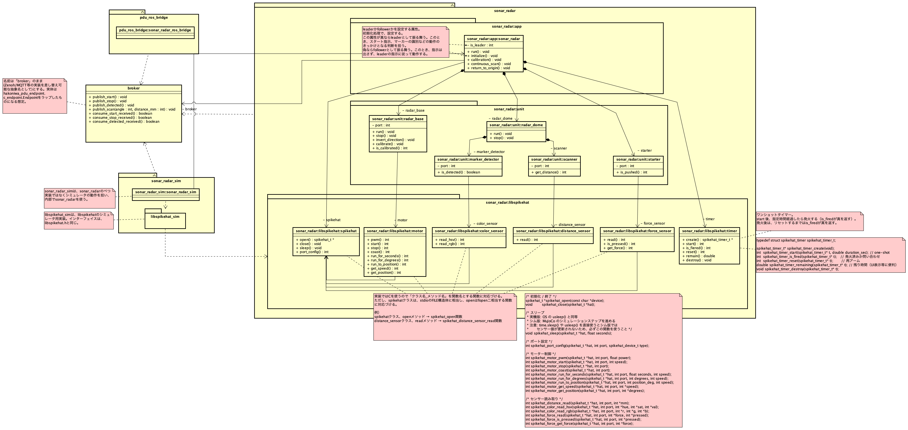
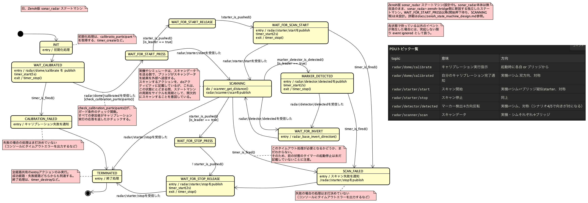

# Zenoh版 sonar_radar ステートマシン設計

実機・シミュレータ・ブリッジをZenoh経由で同期させるための、独立したステートマシン「Zenoh版 sonar_radar」の設計ドキュメント。

状態機械図・クラス図の正本はAstahプロジェクト [`docs/sonar_radar_zenoh_bridge.asta`](sonar_radar_zenoh_bridge.asta) にある。図はAstahのエクスポート機能で `docs/diagrams/` 配下に構造ツリーと同じ階層で書き出し、このMarkdownからはその画像を参照する。図を更新したら同じパスへ再エクスポートするだけでよく、本文側のリンク修正や画像差し替えは不要。このMarkdownは、その設計に至った経緯と、現時点の設計内容・未決事項をテキストで追えるようにするための副読資料。

## 背景: 設計の転回

当初は `sonar_radar` 本体（`SonarRadarSM`）に `WAIT_FOR_PEER_CALIBRATED` 状態と `on_event`/`notify_*()` フックを追加する形で実装した（コミット `038ed15`）。実機・シム双方で動作確認まで行ったが、実際にマシン間連携をテストする過程で以下が判明し、設計を見直した。

1. **Zenohの自己ループバック**: `z_declare_subscriber` はデフォルトで自分自身の publish も受信する。`ZC_LOCALITY_REMOTE` で止められるが、hakoniwa-pdu-endpoint は endpoint ごとに単一の subscriber しか持たないため、チャンネル単位の制御ができない。
2. **起動順序に依存する取りこぼし**: Zenoh の pub/sub は「その瞬間に購読している」相手にしか届かない。先に `calibrated` を publish した側がいると、後から起動した側はそれを一生受け取れない。
3. **「実機のクリックはローカルで特別扱い」という非対称設計のまずさ**: 実機の物理クリックだけローカル即時遷移し、シムへは通知だけする、という設計は Pub/Sub の producer/consumer モデルとして非対称だった。

これらを踏まえて、以下の方針に転回した。

- **`sonar_radar` 本体は完全に無改造のまま**。`sonar_radar-zenoh-bridge` は `sonar_radar` を import すらしない。
- `sonar_radar-zenoh-bridge` 側に、同じドメイン（キャリブレーション・starter・スキャン）を扱うが **Zenoh イベント駆動で動く、独立した新しいステートマシン**（以下「Zenoh版 sonar_radar」）を新設する。
- start/stop/detected は **Pub/Sub の producer/consumer モデルで対称に扱う**: 物理センサーの検知は「発行」のトリガーに過ぎず、状態遷移は常に「受信」経由で起きる（自分の発行が自分にループバックしてくることも許容し、特別扱いしない）。
- calibrated は producer/consumer では表せない（各自が独立に自分の完了を報告し合うものなので）。**静的コンフィギュレーションで参加者一覧を持ち**、受信した origin の集合が参加者集合を包含したら揃ったとみなす。台数をロジックにハードコードしない。
- 揃うのを待ち続けて詰まないよう、**タイムアウトで打ち切って先へ進める**（または失敗として終了する）経路を用意する。

その後、詳細設計を進める過程でさらに以下が判明・確定した。

- ローカルの物理検知（ボタン押下・マーカー検出）とリモートからの受信は、扱いが本質的に異なる。前者は「状態を変えずにpublishするだけ」、後者は「実際にlibspikehatを呼び出し、状態も遷移する」。この2つをステートマシン上で明確に書き分ける必要がある。
- 複数マシンが同時に同じ物理判断（スタート指示・マーカー識別）をローカルに行うと衝突するため、権限を持つ側と持たない側の役割分担が必要（マーカー識別は`is_leader`属性、スタート指示は`is_starter`属性。両者は独立）。権限を持つ側のみがローカル検知で動作の起点となり、持たない側は発行されたコマンドの受信のみで追従する。

## 背景: キャリブレーション協調の廃止（2度目の設計転回）

シナリオ1（実機単体）・シナリオ2（シム単体）・実機+Macの2台構成それぞれで動作検証を重ねる過程で、上記の「`calibration_participants`が揃うのを待つ」設計自体が、人の操作速度に依存する形で壊れやすいことが判明した。

- Mac(`run_hako.py`)側は`hako-cmd start`という、人が任意のタイミングで押す唯一の開始トリガーを境にしてしか`broker.open()`(Zenoh購読開始)ができない。この購読開始が遅れている間に、相手側が`calibrated`をpublishしてしまうと、Zenohは購読開始前のpublishを再送しないため一生受信できない。
- 「実機を先に起動してからMacの`hako-cmd start`を押す」という順序ルールを2度定め直したが、それでも失敗した。実機側のキャリブレーション自体が数秒で終わってしまうため、人がチャット文面を読んで`hako-cmd start`を打鍵する時間より速く完了し、後から購読を開くMac側が結局間に合わなかった。
- 根本原因は順序の問題ではなく、**「購読開始が人の操作待ちでゲートされている側は、どちらが先でも相手の完了に間に合わない可能性がある」**という構造そのものにあった。

これを受けて、**マシン間のキャリブレーション協調を完全に廃止**する方針に転回した。各マシン（実機・シム）は、人が起動してからキャリブレーションが終わるまでを、他マシンとの通信なしに独立して完結させる。

- `INIT`（`broker.open()` → `hardware_initialize()`）から `CALIBRATING`（ローカルなハードウェアキャリブレーションのみ、ネットワーク協調なし）までを、人が起動してから完了するまで1つの流れに閉じ込め、完了したら自動的に`WAIT_FOR_START_PRESS`へ遷移する。
- `WAIT_FOR_CALIBRATE`／`WAIT_FOR_CALIBRATED`の2状態、`calibrate`／`calibrated`のPDUメッセージ、`check_calibration_participants()`ガードは全廃した。
- `CALIBRATION_FAILED`は残す。ただし用途は「マシン間協調の失敗」ではなく「**ローカルなハードウェア障害**（物理的にモーターが固着している等）」に限定し、タイムアウトは20秒とする。
- `timer_stop()`は、本来「`CALIBRATING`でなくなったら止める」という性質のものなので、`CALIBRATING`のexitのみで呼ぶ（`CALIBRATION_FAILED`のentryでの重複呼び出しはしない）。

## 用語

- **event**: 状態遷移のトリガーとなる出来事（例: `radar/starter/start` 受信、タイムアウト発火）
- **guard**: event 発生時に評価する条件。真のときだけ遷移が成立する（偽なら暗黙に自己ループ）
- **is_leader**: 実機かシムかを問わず、そのインスタンスがマーカー識別・方向反転(`marker_detector_is_detected()`/`radar_base_invert_direction()`)の判断を担うかどうかを表す属性。真ならローカルのマーカー検出で動く、偽なら受信のみで動く。初期化時に設定する。
- **is_starter**: そのインスタンスがローカルの`starter_is_pushed()`判定・`start`/`stop`の発行を担うかどうかを表す属性。`is_leader`とは独立(2026-08-03に分離。以前は`is_leader`が両方を兼ねていたが、`pdu_ros_bridge`のような「実機・シムどちらでもない外部からstart/stopを注入する」経路を導入する過程で、権限を分けて考える必要が生じた)。未指定時は`is_leader`と同値になる(既存呼び出し元との後方互換)。`start`/`stop`の受信(`consume_start_received()`/`consume_stop_received()`)には`is_leader`/`is_starter`いずれのガードも無いため、`is_starter`は「注入する側」だけの属性であり、実機・シム以外(`broker`経由の外部)から`start`/`stopを注入する場合、その注入元は`is_starter`属性を持たない(そもそも`sonar_radar`クラスのインスタンスではないため)。
- **origin**: PDUメッセージの送信元識別子。`publish_state()`が状態名にoriginを付与する（`watch_state.py`が複数マシンの状態遷移を区別するための観測用途）。キャリブレーション協調の廃止に伴い、origin単位の到達確認（`is_calibrated_received_from`等）は使わなくなった。

## アーキテクチャ概要

クラス図（`docs/sonar_radar_zenoh_bridge.asta`）上で、システムは3つのサブシステムに分かれる。

- **`sonar_radar`**（実機）: `app` パッケージ（`sonar_radar::app::sonar_radar` — 本ステートマシンを実行するクラス。`run()` が tick ごとに呼ばれる想定）と `unit` パッケージ（`radar_base`・`radar_dome`＋その配下の `marker_detector`／`scanner`／`starter`）、およびハードウェア抽象化の `libspikehat` パッケージ（`spikehat`／`motor`／`color_sensor`／`distance_sensor`／`force_sensor`／`timer`。実装はC、`ClラスName_メソッド名` を関数名とする対応付け。ワンショットタイマーAPI `spikehat_timer_*` あり）からなる。
- **`sonar_radar_sim`**（シミュレータ）: `sonar_radar` の別実装ではなく、内部で `sonar_radar` を使ってシミュレータの動作を担う。`libspikehat_sim` は `libspikehat.h` と同じインターフェースを持つシム用実装。
- **`pdu_ros_bridge`**（ブリッジ/監視役、Raspberry Pi 5想定）: `sonar_radar_ros_bridge` はまだスタブで詳細未設計。

3サブシステムはいずれも **`broker`** クラスに依存する。`broker` はPDUのpublish/受信を担う抽象層で、名前はZenoh/MQTT等の実装を差し替え可能な抽象名として「broker」のままとし、実体は `hakoniwa_pdu_endpoint.c_endpoint.Endpoint` をラップしたものになる想定。

`broker` のAPI（現時点の一次案）:

- `publish_start()` / `publish_stop()` / `publish_detected()` / `publish_scan(angle, distance_mm)` — ローカル検知側が呼ぶ送信専用API。
- `consume_start_received()` / `consume_stop_received()` / `consume_detected_received() : boolean` — tickループ側がポーリングする受信API。Zenohの受信自体は非同期コールバックだが、`broker` 内部でフラグ化し、これらは一度だけ `true` を返して内部フラグをクリアする（旧 `driver/sonar_radar_zenoh.py` の `notify_*()`／自己ループバック対策と同じ考え方）。

## 状態機械（現状）

State: `sonar_radar::app::sonar_radar` の `run()` が駆動する `ZenohSonarRadarSM`。以下、正本はAstahの `sonar_radar::runのステートマシン図`。

補足:

- 各状態で待っている以外のイベントが発生した場合は、明示的に描いていない限り event ignored（無視して自己ループ）として扱う。
- `starter_is_pushed()`／`marker_detector_is_detected()`／`radar_base_invert_direction()` などのガード・エフェクト表記は、`_` 区切りのC関数名スタイルに統一している（クラス図の「クラス名_メソッド名→関数名」規約に合わせる）。
- ローカル検知/受信の非対称性: `is_leader == true`（マーカー識別）または`is_starter == true`（スタート指示）のガードが付いた遷移（ローカル検知→publishのみ、状態は進む）と、`○○を受信した` イベントの遷移（実アクション＋状態遷移）が対になっている。権限を持たない側はローカル検知の遷移を通らず、受信イベントだけで直接目的の状態へ進む（例: `WAIT_FOR_START_PRESS --radar/starter/startを受信した--> SCANNING`）。権限を持つ側自身も、publishした自分のコマンドを受信して初めて実アクションと状態遷移が起きる（自己ループバックを特別扱いしない）。
- `INIT`→`CALIBRATING`はマシン間通信を伴わないローカル処理のみで、`WAIT_FOR_START_PRESS`へは無条件（ガードなし）で自動遷移する。leader/followerの非対称性や受信イベント待ちが登場するのは`WAIT_FOR_START_PRESS`以降。

### タイマー値は属性名で参照する(即値を図に書かない)

`calibration_timeout_sec`／`scanning_timeout_sec`／`publish_confirm_timeout_sec`は、いずれも`sonar_radar::app::sonar_radar`クラスの属性(クラス図参照、既定値付き)であり、`CLI引数 > コンストラクタ引数 > クラス属性(既定値) > 状態機械図はその属性名を参照`という階層になっている。状態機械図のentryも`timer_start(20s)`のような即値ではなく、`timer_start(calibration_timeout_sec)`のように属性名で書く(以前は即値のままだったが、実測に基づく調整を重ねる中で、コード側は既に属性化されているのに図だけ即値のままという食い違いに気づき、2026-08-02に図側も揃えた)。

`publish_confirm_timeout_sec`(既定2秒)は、`WAIT_FOR_SCAN_START`／`MARKER_DETECTED`／`WAIT_FOR_STOP_RELEASE`の3状態に共通の値。3状態とも「自分のpublishがZenoh経由でループバックしてくるのを待つ」という同じ目的のため、個別の属性に分けず1つにまとめている。

### SCANNINGのタイムアウト(ケーブル巻き込み防止)

`SCANNING`にはentry `timer_start(scanning_timeout_sec)`／exit `timer_stop()`があり、`timer_is_fired()`で`SCAN_FAILED`へ落ちる。`CALIBRATING`のタイムアウト(20秒、`calibration_timeout_sec`)とは目的が逆であることに注意。

- `CALIBRATING`の猶予は「実機で機構のずれを外してはめ直す時間」を見込んだもの。
- `SCANNING`のタイムアウトは「ドームが旋回しすぎてセンサーケーブルを巻き込む前に止める」ための早期カットオフ。むしろ小さく保ちたい。ただしこのリスクは実機だけの物理的な制約で、シムには実在するケーブルが無い。

基準値は、`WAIT_FOR_INVERT`→`SCANNING`の再入がマーカー間の1レッグに対応することから、「1レッグの所要時間＋マージン」とした。1レッグの所要時間は、実機(`192.168.11.3`、`sonar_radar/raspi/sonar_radar.py`を自動起動・自動停止するmeasure_scan_period.py経由、7レッグ実測)で4.28〜5.28秒(平均約4.77秒)、スタンドアロンSIM(`sonar_radar/sim/sonar_radar_sim.py --auto-start --auto-stop`、8レッグ実測)で4.95〜4.97秒(非常に安定)だった。シムは実時間(`--speed 1.0`固定)で実機と直接比較できるよう設計されており(`[[feedback_sonar_radar_realtime_sim]]`参照)、実測でもその前提が裏付けられた。

**ブリッジ経由では、単体計測より+1〜1.5秒程度のオーバーヘッドが乗る**ことが、実機+シムの2台構成テスト(2026-08-02)で判明した。当初「最大実測値(約5.3秒)+α(1秒)=6.3秒」と決めたが、これは単体計測(Zenoh/ブリッジのtickループを介さない`sonar_radar.py`直接実行)の値であり、ブリッジ経由の実際のマーカー間隔はこれより長く(6〜6.4秒程度観測)、6.3秒では実機・シムを跨いだ2台構成でまれに正常な周回がタイムアウトしてしまうことがあった(follower実機が6.3秒で`SCAN_FAILED`に落ち、その`stop`をleader(シム)が受信してSCANNINGから直接TERMINATEDへ落ちる、という経路。設計通りの停止伝播ではあるが、本来失敗ではない周回を失敗扱いしてしまっていた)。

当初、ケーブル巻き込みリスクが実機だけの制約であることを踏まえ、既定値を実機8秒/シム12秒と分けたが、これは新たな問題を生んだ: `SCANNING`のタイムアウトは「leaderとしての物理安全カットオフ」と「followerとして相手(leader)の`detected`を待つ通信タイムアウト」の両方を1つの`scanning_timeout_sec`/タイマーで兼ねているため、**followerのタイムアウトがleaderのタイムアウトより短いと、leader側ではまだ正常範囲内の周回でも、followerが先に見切りをつけて`SCAN_FAILED`に落ちてしまう**(2026-08-03、シムleader+実機followerの構成で発生。実機が8秒でタイムアウトし`stop`をpublish、シムはまだ12秒の猶予内で正常動作中だったが、その`stop`を受けてSCANNINGから直接TERMINATEDへ落ちた)。

そのため、**実機・シムとも既定値を8秒に統一した**(`--scanning-timeout`で個別に上書きすることは引き続き可能)。leader/followerの役割はデモのたびに入れ替わりうるため、follower側のタイムアウトは常にleader側以上でなければならない、という制約がある限り、既定値は両者で揃えておくのが安全側の選択。

- `sonar_radar::app::sonar_radar`クラス自体の既定値: **8秒**
- `bridge/run_real.py`の`--scanning-timeout`既定値: **8秒**
- `bridge/run_hako.py`の`--scanning-timeout`既定値: **8秒**(2026-08-02時点では12秒にしていたが、上記の理由で8秒に戻した)

**根本的な課題(未対応、備忘)**: タイムアウトのマージンで調整するのは対症療法で、本質的には実機とシムの旋回位置が互いに独立して自走しており、同期していないことが問題。将来的には、followerがleaderのエンコーダ角度を読んで追従旋回する(自分のペースで回らず、leaderの動きに従属する)設計に変えることで、両者の位置がずれる余地自体を無くせる可能性がある。Zenoh経由の遅延など別の懸念も残るが、leaderがマーカーとタイムアウトで安全に囲われて動いていれば、followerは現状より確実に追従できると見込まれる(暴走・通信途絶時の安全装置として、タイムアウトによる遷移自体は引き続き必要)。

### radar_baseの継続旋回(run/stop/invert_direction)

`SCANNING`のentryには`radar_base_run()`もある(`timer_start(scanning_timeout_sec)`と並べて)。`radar_base_run()`は冪等(既に回転中なら何もしない)で、`WAIT_FOR_INVERT`から`SCANNING`へ戻るたびに呼ばれても再始動しない。回転の停止は`TERMINATED`のentryで`radar_base_stop()`を1箇所だけ呼ぶ(`broker.close()`／`timer_destroy()`と並べて)。マーカー検出による方向転換(`WAIT_FOR_INVERT`のentry `radar_base_invert_direction()`)は、停止せずPWM符号を反転するだけで継続する(`sonar_radar.py`の`_tick_scanning()`と同じ設計)。

### PDUトピック一覧

| topic | 意味 | 方向 |
|---|---|---|
| `radar/starter/start` | スキャン開始 | 実機⇔シム⇔ブリッジ、疑似starter、対称 |
| `radar/starter/stop` | スキャン停止 | 同上 |
| `radar/detector/detected` | マーカー検出→方向反転 | 実機⇔シム、対称（シナリオにより向きが対になる） |
| `radar/scanner/scan` | スキャンデータ | 実機・シムそれぞれ→ブリッジ |

## 未確定・要検討事項

- `WAIT_FOR_START_PRESS`／`WAIT_FOR_START_RELEASE`／`WAIT_FOR_STOP_PRESS` にタイムアウトが必要かどうか(人やロボットの押下待ちに上限を設けるか)。
- `CALIBRATION_FAILED`／`SCAN_FAILED` の失敗時処理の具体化（コンソールへのエラー出力など、内容未定）。
- `pdu_ros_bridge::sonar_radar_ros_bridge`（ブリッジ/監視役）は未設計。
- Raspberry Pi 5（ブリッジ役）でのhakoniwa-pdu-endpointインストール・本シナリオ向け設定（`config/raspi5/`）は未実施。
- `sonar_radar` 本体のコミット `038ed15`（旧設計のフック追加）の差し戻しは未実施のまま（`sonar_radar-zenoh-bridge` は無改造の `sonar_radar` に依存する設計のため動作のブロッカーではないが、後片付けとして残っている）。
- 実機＋シム（＋ブリッジ）でのエンドツーエンド結合テストは未実施。

## 関連する既存の実装済み部品

- `pdu/pdudef.json`, `pdu/pdutypes.json`: チャンネル構成（start/stop/detected/scan）は現行設計でも概ね流用できる見込み。`calibrate`/`calibrated`チャンネルはキャリブレーション協調の廃止により不要になったため、コード追従時に削除する。
- `config/{mac,raspi4b}/`: zenoh endpoint 設定は流用可能。
- 旧 `driver/sonar_radar_zenoh.py` の origin識別子（`_ORIGIN = {"real": b"\x01", "sim": b"\x02"}`）による自己判別の仕組み、および非同期コールバックをポーリングフラグに変換する考え方は、`broker` の実装にそのまま使える。このファイル自体は `SonarRadarSM` への依存を含む旧設計のものであり、`broker`／`sonar_radar::app::sonar_radar` を軸に全面的に書き直す。
