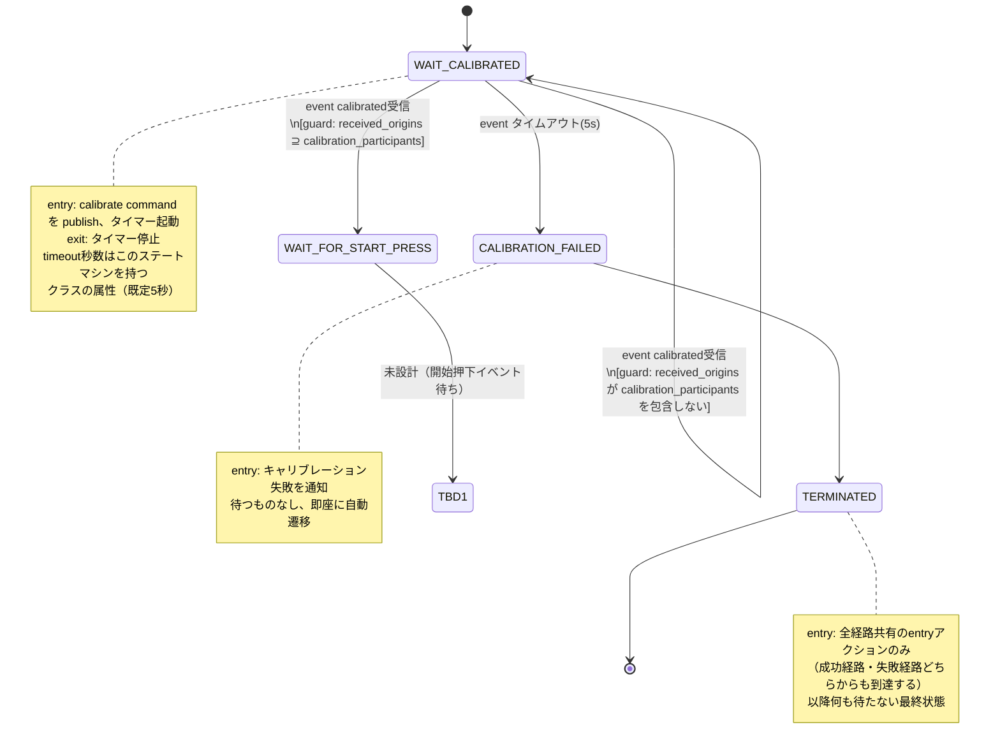

# Zenoh版 sonar_radar ステートマシン設計

設計途中のドキュメント。状態機械図を育てながら設計を進める。

## 背景: 設計の転回

当初は `sonar_radar` 本体（`SonarRadarSM`）に `WAIT_FOR_PEER_CALIBRATED` 状態と `on_event`/`notify_*()` フックを追加する形で実装した（コミット `038ed15`）。実機・シム双方で動作確認まで行ったが、実際にマシン間連携をテストする過程で以下が判明し、設計を見直した。

1. **Zenohの自己ループバック**: `z_declare_subscriber` はデフォルトで自分自身の publish も受信する。`ZC_LOCALITY_REMOTE` で止められるが、hakoniwa-pdu-endpoint は endpoint ごとに単一の subscriber しか持たないため、チャンネル単位の制御ができない。
2. **起動順序に依存する取りこぼし**: Zenoh の pub/sub は「その瞬間に購読している」相手にしか届かない。先に `calibrated` を publish した側がいると、後から起動した側はそれを一生受け取れない。
3. **「実機のクリックはローカルで特別扱い」という非対称设计のまずさ**: 実機の物理クリックだけローカル即時遷移し、シムへは通知だけする、という設計は Pub/Sub の producer/consumer モデルとして非対称だった。

これらを踏まえて、以下の方針に転回した。

- **`sonar_radar` 本体は完全に無改造のまま**。`sonar_radar-zenoh-bridge` は `sonar_radar` を import すらしない。
- `sonar_radar-zenoh-bridge` 側に、同じドメイン（キャリブレーション・starter・スキャン）を扱うが **Zenoh イベント駆動で動く、独立した新しいステートマシン**（以下「Zenoh版 sonar_radar」）を新設する。
- start/stop/detected は **Pub/Sub の producer/consumer モデルで対称に扱う**: 物理センサーの検知は「発行」のトリガーに過ぎず、状態遷移は常に「受信」経由で起きる（自分の発行が自分にループバックしてくることも許容し、特別扱いしない）。
- calibrated は producer/consumer では表せない（各自が独立に自分の完了を報告し合うものなので）。**静的コンフィギュレーションで参加者一覧を持ち**、受信した origin の集合が参加者集合を包含したら揃ったとみなす。台数をロジックにハードコードしない。
- 揃うのを待ち続けて詰まないよう、**タイムアウトで打ち切って先へ進める**（または失敗として終了する）経路を用意する。

## 用語

- **event**: 状態遷移のトリガーとなる出来事（例: `calibrated` 受信、タイムアウト発火）
- **guard**: event 発生時に評価する条件。真のときだけ遷移が成立する（偽なら暗黙に自己ループ）
- **calibration_participants**: この試行でキャリブレーション報告が必要な origin の集合（静的コンフィギュレーション、例: `{"real", "sim"}`）
- **received_origins**: 現在までに `calibrated` を受信した origin の集合（自分自身の発行がループバックしてきた分も含む）

## 状態機械図（設計中）

`TBD1` 以降（`WAIT_FOR_START_PRESS` の詳細、`WAIT_FOR_START_RELEASE` 相当の状態、`SCANNING` 相当の状態、`detected` の扱い等）は未設計。次回の設計セッションで続ける。

## 未確定・要検討事項

- `WAIT_FOR_START_PRESS`／`WAIT_FOR_START_RELEASE`（クリック＝押下→解放のエッジ検出をどう2状態に割るか）
- SCANNING 中の `detected`（マーカー検出）の producer/consumer 対称設計の具体化
- SCANNING 中の stop（start と対称のはずだが、タイムアウト等の要否は未検討）
- 実際にモーター・センサーを駆動する `hat` をこの新ステートマシンがどう受け取るか（`sonar_radar` を import しない前提でのハードウェア抽象化の再設計）
- `CALIBRATION_FAILED` の「通知」の具体的な内容・宛先（ログのみか、別チャンネルで publish するか）
- 参加者コンフィグ（`calibration_participants`）の置き場所とファイル形式

## 関連する既存の実装済み部品（設計転回前のもの、要見直し）

- `driver/sonar_radar_zenoh.py`: 現状は `sonar_radar` の `SonarRadarSM` を import して `on_event`/`notify_*()` で配線する実装。今回の転回により、この import 依存とフック配線は不要になる見込み。全面的な書き直しが必要。
- `pdu/pdudef.json`, `pdu/pdutypes.json`: チャンネル構成（calibrate/calibrated/start/stop/detected/scan）自体は今回の設計でも概ね流用できる見込み。
- `config/{mac,raspi4b}/`: zenoh endpoint 設定は流用可能。
- origin識別子（`_ORIGIN = {"real": b"\x01", "sim": b"\x02"}`）による自己判別の仕組みは、`received_origins` の実装にそのまま使える。
