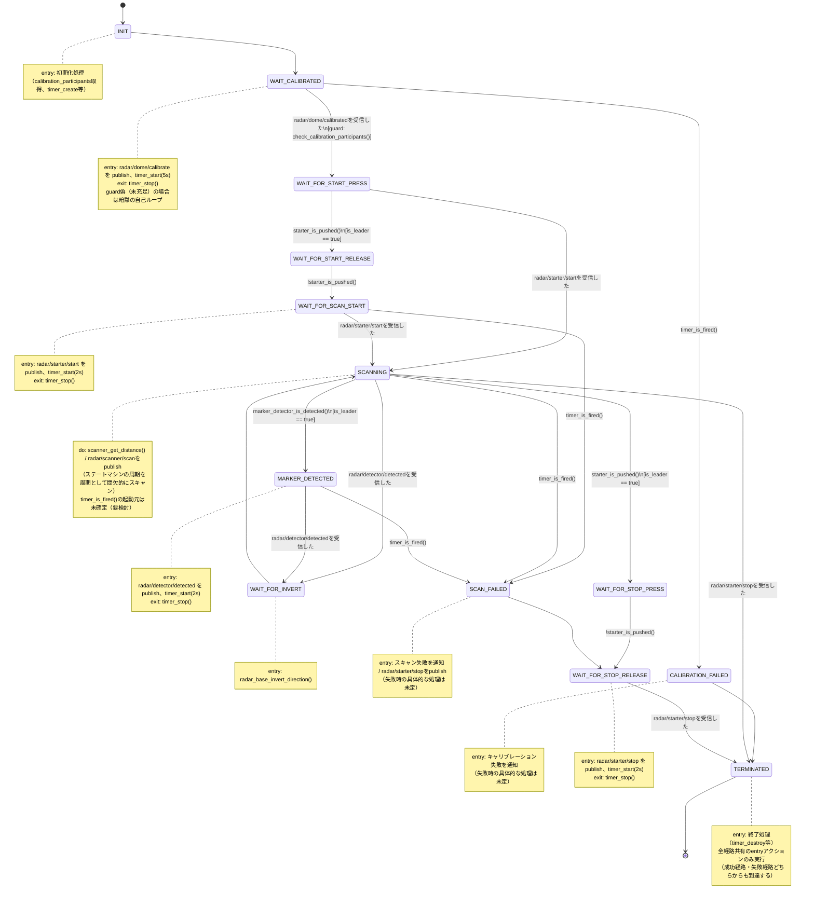

# Zenoh版 sonar_radar ステートマシン設計

実機・シミュレータ・ブリッジをZenoh経由で同期させるための、独立したステートマシン「Zenoh版 sonar_radar」の設計ドキュメント。

状態機械図・クラス図の正本はAstahプロジェクト [`docs/sonar_radar_zenoh_bridge.asta`](sonar_radar_zenoh_bridge.asta) にある。このMarkdownは、その設計に至った経緯と、現時点の設計内容・未決事項をテキストで追えるようにするための副読資料。

## 背景: 設計の転回

当初は `sonar_radar` 本体（`SonarRadarSM`）に `WAIT_FOR_PEER_CALIBRATED` 状態と `on_event`/`notify_*()` フックを追加する形で実装した（コミット `038ed15`）。実機・シム双方で動作確認まで行ったが、実際にマシン間連携をテストする過程で以下が判明し、設計を見直した。

1. **Zenohの自己ループバック**: `z_declare_subscriber` はデフォルトで自分自身の publish も受信する。`ZC_LOCALITY_REMOTE` で止められるが、hakoniwa-pdu-endpoint は endpoint ごとに単一の subscriber しか持たないため、チャンネル単位の制御ができない。
2. **起動順序に依存する取りこぼし**: Zenoh の pub/sub は「その瞬間に購読している」相手にしか届かない。先に `calibrated` を publish した側がいると、後から起動した側はそれを一生受け取れない。
3. **「実機のクリックはローカルで特別扱い」という非対称設計のまずさ**: 実機の物理クリックだけローカル即時遷移し、シムへは通知だけする、という設計は Pub/Sub の producer/consumer モデルとして非対称だった。

これらを踏まえて、以下の方針に転回した。

- **`sonar_radar` 本体は完全に無改造のまま**。`sonar_radar-zenoh-bridge` は `sonar_radar` を import すらしない。
- `sonar_radar-zenoh-bridge` 側に、同じドメイン（キャリブレーション・starter・スキャン）を扱うが **Zenoh イベント駆動で動く、独立した新しいステートマシン**（以下「Zenoh版 sonar_radar」）を新設する。
- start/stop/detected は **Pub/Sub の producer/consumer モデルで対称に扱う**: 物理センサーの検知は「発行」のトリガーに過ぎず、状態遷移は常に「受信」経由で起きる（自分の発行が自分にループバックしてくることも許容し、特別扱いしない）。
- calibrated は producer/consumer では表せない（各自が独立に自分の完了を報告し合うものなので）。**静的コンフィギュレーションで参加者一覧を持ち**、受信した origin の集合が参加者集合を包含したら揃ったとみなす。台数をロジックにハードコードしない。
- 揃うのを待ち続けて詰まないよう、**タイムアウトで打ち切って先へ進める**（または失敗として終了する）経路を用意する。

その後、詳細設計を進める過程でさらに以下が判明・確定した。

- ローカルの物理検知（ボタン押下・マーカー検出）とリモートからの受信は、扱いが本質的に異なる。前者は「状態を変えずにpublishするだけ」、後者は「実際にlibspikehatを呼び出し、状態も遷移する」。この2つをステートマシン上で明確に書き分ける必要がある。
- 複数マシンが同時に同じ物理判断（スタート指示・マーカー識別）をローカルに行うと衝突するため、**leader/follower** の役割分担が必要（`is_leader` 属性）。leaderのみがローカル検知で動作の起点となり、followerはleaderの発行したコマンドの受信のみで追従する。

## 用語

- **event**: 状態遷移のトリガーとなる出来事（例: `calibrated` 受信、タイムアウト発火）
- **guard**: event 発生時に評価する条件。真のときだけ遷移が成立する（偽なら暗黙に自己ループ）
- **calibration_participants**: この試行でキャリブレーション報告が必要な origin の集合（静的コンフィギュレーション、例: `{"real", "sim"}`）。`sonar_radar::app::sonar_radar` がINIT時に取得・保持する。
- **received_origins**: 現在までに `calibrated` を受信した origin の集合（自分自身の発行がループバックしてきた分も含む）。実体は `broker` 側で管理する。
- **is_leader**: 実機かシムかを問わず、そのインスタンスがスタート指示・マーカー識別など動作のきっかけとなる判断を担うかどうかを表す属性。真ならleader（ローカル検知で動く）、偽ならfollower（受信のみで動く）。初期化時に設定する。
- **origin**: PDUメッセージの送信元識別子。旧実装の `_ORIGIN = {"real": 1, "sim": 2}` に相当し、`broker.is_calibrated_received_from(origin)` 等で使う。

## アーキテクチャ概要

クラス図（`docs/sonar_radar_zenoh_bridge.asta`）上で、システムは3つのサブシステムに分かれる。

- **`sonar_radar`**（実機）: `app` パッケージ（`sonar_radar::app::sonar_radar` — 本ステートマシンを実行するクラス。`run()` が tick ごとに呼ばれる想定）と `unit` パッケージ（`radar_base`・`radar_dome`＋その配下の `marker_detector`／`scanner`／`starter`）、およびハードウェア抽象化の `libspikehat` パッケージ（`spikehat`／`motor`／`color_sensor`／`distance_sensor`／`force_sensor`／`timer`。実装はC、`ClラスName_メソッド名` を関数名とする対応付け。ワンショットタイマーAPI `spikehat_timer_*` あり）からなる。
- **`sonar_radar_sim`**（シミュレータ）: `sonar_radar` の別実装ではなく、内部で `sonar_radar` を使ってシミュレータの動作を担う。`libspikehat_sim` は `libspikehat.h` と同じインターフェースを持つシム用実装。
- **`pdu_ros_bridge`**（ブリッジ/監視役、Raspberry Pi 5想定）: `sonar_radar_ros_bridge` はまだスタブで詳細未設計。

3サブシステムはいずれも **`broker`** クラスに依存する。`broker` はPDUのpublish/受信を担う抽象層で、名前はZenoh/MQTT等の実装を差し替え可能な抽象名として「broker」のままとし、実体は `hakoniwa_pdu_endpoint.c_endpoint.Endpoint` をラップしたものになる想定。

`broker` のAPI（現時点の一次案）:

- `publish_calibrate()` / `publish_calibrated()` / `publish_start()` / `publish_stop()` / `publish_detected()` / `publish_scan(angle, distance_mm)` — ローカル検知側が呼ぶ送信専用API。
- `consume_start_received()` / `consume_stop_received()` / `consume_detected_received() : boolean` — tickループ側がポーリングする受信API。Zenohの受信自体は非同期コールバックだが、`broker` 内部でフラグ化し、これらは一度だけ `true` を返して内部フラグをクリアする（旧 `driver/sonar_radar_zenoh.py` の `notify_*()`／自己ループバック対策と同じ考え方）。
- `is_calibrated_received_from(origin) : boolean` — `calibrated` はcount/booleanでなくorigin単位の到達確認が必要なため専用API。`calibration_participants` 自体は `sonar_radar::app::sonar_radar` 側が保持し、`broker` からの受信状況と突き合わせて `check_calibration_participants()` を判定する。

## 状態機械（現状）

State: `sonar_radar::app::sonar_radar` の `run()` が駆動する `ZenohSonarRadarSM`。以下、正本はAstahの `sonar_radar::runのステートマシン図`。

補足:

- 各状態で待っている以外のイベントが発生した場合は、明示的に描いていない限り event ignored（無視して自己ループ）として扱う。
- `starter_is_pushed()`／`marker_detector_is_detected()`／`radar_base_invert_direction()` などのガード・エフェクト表記は、`_` 区切りのC関数名スタイルに統一している（クラス図の「クラス名_メソッド名→関数名」規約に合わせる）。
- leader/followerの非対称性: `is_leader == true` のガードが付いた遷移（ローカル検知→publishのみ、状態は進む）と、`○○を受信した` イベントの遷移（実アクション＋状態遷移）が対になっている。followerはローカル検知の遷移を通らず、受信イベントだけで直接目的の状態へ進む（例: `WAIT_FOR_START_PRESS --radar/starter/startを受信した--> SCANNING`）。leader自身も、publishした自分のコマンドを受信して初めて実アクションと状態遷移が起きる（自己ループバックを特別扱いしない）。

### PDUトピック一覧

| topic | 意味 | 方向 |
|---|---|---|
| `radar/dome/calibrate` | キャリブレーション実行指示 | 起動時に各自 or ブリッジから |
| `radar/dome/calibrated` | 自分のキャリブレーション完了通知 | 実機⇔シム 双方向、対称 |
| `radar/starter/start` | スキャン開始 | 実機⇔シム⇔ブリッジ、疑似starter、対称 |
| `radar/starter/stop` | スキャン停止 | 同上 |
| `radar/detector/detected` | マーカー検出→方向反転 | 実機⇔シム、対称（シナリオにより向きが対になる） |
| `radar/scanner/scan` | スキャンデータ | 実機・シムそれぞれ→ブリッジ |

## 未確定・要検討事項

- `SCANNING` の `timer_is_fired()` → `SCAN_FAILED` 遷移: このタイマーがどこで起動されるか（`SCANNING` にはentry/タイマー起動アクションがない）が未確定。
- `WAIT_FOR_START_PRESS`／`WAIT_FOR_START_RELEASE`／`WAIT_FOR_STOP_PRESS` にタイムアウトが必要かどうか（人やロボットの押下待ちに上限を設けるか）。
- `CALIBRATION_FAILED`／`SCAN_FAILED` の失敗時処理の具体化（コンソールへのエラー出力など、内容未定）。
- `broker` の実装（`hakoniwa_pdu_endpoint.c_endpoint.Endpoint` のラップ）は未着手。API設計のみ。
- `pdu_ros_bridge::sonar_radar_ros_bridge`（ブリッジ/監視役）は未設計。
- Raspberry Pi 5（ブリッジ役）でのhakoniwa-pdu-endpointインストール・本シナリオ向け設定（`config/raspi5/`）は未実施。
- `sonar_radar` 本体のコミット `038ed15`（旧設計のフック追加）の差し戻しは未実施のまま（`sonar_radar-zenoh-bridge` は無改造の `sonar_radar` に依存する設計のため動作のブロッカーではないが、後片付けとして残っている）。
- 実機＋シム（＋ブリッジ）でのエンドツーエンド結合テストは未実施。

## 関連する既存の実装済み部品

- `pdu/pdudef.json`, `pdu/pdutypes.json`: チャンネル構成（calibrate/calibrated/start/stop/detected/scan）は現行設計でも概ね流用できる見込み。
- `config/{mac,raspi4b}/`: zenoh endpoint 設定は流用可能。
- 旧 `driver/sonar_radar_zenoh.py` の origin識別子（`_ORIGIN = {"real": b"\x01", "sim": b"\x02"}`）による自己判別の仕組み、および非同期コールバックをポーリングフラグに変換する考え方は、`broker` の実装にそのまま使える。このファイル自体は `SonarRadarSM` への依存を含む旧設計のものであり、`broker`／`sonar_radar::app::sonar_radar` を軸に全面的に書き直す。
